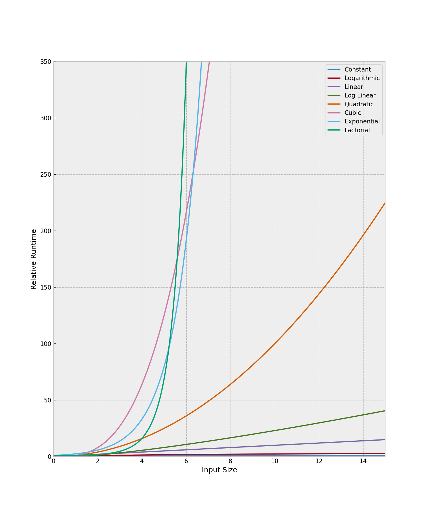

# Datenbankenunterricht by Dominik

## Learning by reading

### Basic Syntax

`SELECT` gibt an welche Daten ausgegeben werden sollen. Im normalfall sind das die Spalten.

`FROM` gibt an, aus welcher Tabelle die Daten kommen.

`WHERE` gibt an, welche Bedingungen die Daten erfüllen müssen. Nur Zeilen, die die Bedingungen erfüllen werden ausgegeben.

`ORDER BY` gibt an, nach welcher Spalte die Daten sortiert werden sollen. `ASC` für aufsteigend und `DESC` für absteigend.

### `WHERE` beispiele

#### Zahlen größer / kleiner / gleich

```SQL
SELECT Name, Einwohner
FROM t1_ort
WHERE einwohner > 1000;
```

| Name            | Einwohner |
|:----------------|:----------|
| Tschaghtscharan | 15000     |
| Tscharikar      | 69110     |
| Mehtarlam       | 70000     |
| Ghazni          | 72360     |
| Taloqan         | 87970     |
| ...             | ...       |

```SQL
SELECT Name, Einwohner
FROM t1_ort
WHERE einwohner < 1000;
```

| Name                   | Einwohner |
|:-----------------------|:----------|
| Byrum                  | 444       |
| Tranebjerg             | 839       |
| Wiedenborstel          | 5         |
| Dierfeld               | 7         |
| Ammeldingen an der Our | 8         |
| ...                    | ...       |

```SQL
SELECT Name, Einwohner
FROM t1_ort
WHERE einwohner = 1000;
```

| Name                | Einwohner |
|:--------------------|:----------|
| Brachwitz bei Halle | 1000      |
| Nemsdorf-Göhrendorf | 1000      |
| Churchill           | 1000      |
| Slöinge             | 1000      |

#### Texte

```SQL
SELECT Name, Einwohner, Land
FROM t1_ort
WHERE name = 'Berlin';
```

| Name   | Einwohner | Land                           |
|:-------|:----------|:-------------------------------|
| Berlin | 3613495   | Deutschland                    |
| Berlin | 10200     | El Salvador                    |
| Berlin | 10300     | Vereinigte Staaten von Amerika |
| Berlin | 19590     | Vereinigte Staaten von Amerika |

##### Teiltexte

Das `%` Zeichen steht für beliebig viele beliebige Zeichen.
Eine 'Wildcard'.
Hier darf dann aber nicht mehr `=` verwendet werden, sondern `LIKE`.

```SQL
SELECT Name, Einwohner
FROM t1_ort
WHERE name LIKE '%heim';
```

| Name                   | Einwohner |
|:-----------------------|:----------|
| Rehbach bei Sobernheim | 38        |
| Philippsheim           | 121       |
| Birkheim               | 143       |
| Dintesheim             | 150       |
| Immesheim              | 160       |
| ...                    | ...       |

### `ORDER BY` beispiele

```SQL
SELECT Name, Einwohner
FROM t1_ort
ORDER BY einwohner DESC;
```

| Name     | Einwohner |
|:---------|:----------|
| Shanghai | 23019148  |
| Delhi    | 16787941  |
| Mumbai   | 15414288  |
| Karachi  | 14910352  |
| Lagos    | 14370000  |
| ...      | ...       |

### Joins

Beide Tabellen auswählen und eine Bedingung in `WHERE` schreiben.
Man muss überprüfen, ob die Spalten in beiden Tabellen gleich sind.
Also wie in diesem Beispiel die `LNR`s der jeweiligen Tabellen.

```SQL
SELECT o.Name, l.Name, o.Einwohner
FROM t3_ort o,
     t3_land l
WHERE o.LNR = l.LNR;
```

#### Mehr Joins als Tabellen

```SQL
select o.name, l.name, o2.name
from t3_ort o,
     t3_land l,
     t3_ort o2
where o.LNR = l.LNR
  and l.HauptONR = o2.ONR;
```

| name                     | name       | name |
|:-------------------------|:-----------|:-----|
| Annaberg                 | Österreich | Wien |
| Attnang-Puchheim         | Österreich | Wien |
| Bad Wimsbach-Neydharting | Österreich | Wien |
| Behamberg                | Österreich | Wien |
| Bad Blumau               | Österreich | Wien |
| ...                      | ...        | ...  |

### Ausgabe `AS`

Nehmen wir doch das beispiel von oben. Da gibt es drei Spalten, die `name` heißen.
Das ist nicht schön. benennen wir sie doch um.

```SQL
select o.name as ort, l.name as land, o2.name as hauptstadt
from t3_ort o,
     t3_land l,
     t3_ort o2
where o.LNR = l.LNR
  and l.HauptONR = o2.ONR;
```

| ort                      | land       | hauptstadt |
|:-------------------------|:-----------|:-----------|
| Annaberg                 | Österreich | Wien       |
| Attnang-Puchheim         | Österreich | Wien       |
| Bad Wimsbach-Neydharting | Österreich | Wien       |
| Behamberg                | Österreich | Wien       |
| Bad Blumau               | Österreich | Wien       |
| ...                      | ...        | ...        |

## Learning by doing

### Einfache Abfragen

> Hier kannst du `t1_ort` und `t1_land` verwenden.

```SQL
select *
from t1_ort
where land = 'Deutschland'
```

| Name                   | Land        | Einwohner | Laenge | Breite  |
|:-----------------------|:------------|:----------|:-------|:--------|
| Wiedenborstel          | Deutschland | 5         | 9.7667 | 54.0500 |
| Dierfeld               | Deutschland | 7         | 6.8833 | 50.0833 |
| Ammeldingen an der Our | Deutschland | 8         | 6.2500 | 49.9000 |
| Gemünd an der Our      | Deutschland | 16        | 6.1667 | 49.9833 |
| Hisel, Eifel           | Deutschland | 17        | 6.3667 | 49.9667 |
| ...                    | ...         | ...       | ...    | ...     |

> **Aufgabe 1**
>
> Schreibe eine SQL-Abfrage, um alle Orte in Frankreich zu finden, und gebe dabei den Namen, die Einwohnerzahl, die Länge und die Breite aus.

```SQL


```

> **Aufgabe 2**
>
> Das gleiche wie Aufgabe 1, aber sortiere die Ergebnisse nach der Einwohnerzahl absteigend.

```SQL


```

> **Aufgabe 3**
>
> Nochmal das gleiche, aber nur die Orte mit mehr als 1000 Einwohnern.

```SQL


```

> **Aufgabe 4**
>
> Jetzt mal was anderes. Jetzt hätte ich gern alle Orte, die in Deutschland liegen und deren Name mit 'heim' endet und die zwischen 10 Mio. und 1000 Mio. Einwohner haben.

```SQL


```

### Relationen, Joins, Verknüpfungen, Verbindungen, nenn es wie du willst

> Jetzt musst du `t3_ort`, `t3_land` und `t3_kontinent` verwenden.
> Nur die Tabellen haben relationen.


> **Aufgabe 5**
>
> Geb den Name, das Land und die Einwohnerzahl aller Orte in Deutschland aus, die Spaichingen heißen.

```SQL


```

> **Aufgabe 6**
> 
> Nice aber bitte mach es nochmal so, das nicht 2-mal `name` in der Ausgabe steht.

```SQL


```

> **Aufgabe 7**
> 
> Jetzt hätte ich gerne jede Hauptstadt und den dazugehörigen Kontinent.

```SQL


```

# O-Notation

Es wird immer "gegen unendlich" gerechnet. Das bedeutet, O(5n) ist das gleiche wie O(n).



## O(1)

Ein direkter zugriff. Man weiß schon, wo die Daten sind.

```javascript
arr = [1, 2, 3, 4, 5, 6, 7, 8, 9, 10];
console.log(arr[0]);
```

## O(log n)

Für jeden schritt den man macht, halbiert sich die Anzahl der Daten.

```javascript
arr = [1, 2, 3, 4, 5, 6, 7, 8, 9, 10];
for (let i = 0; i < arr.length; i *= 2) {
    console.log(arr[i]);
}
```

## O(n)

Man muss für jeden Datensatz einmal durchgehen.

```javascript
arr = [1, 2, 3, 4, 5, 6, 7, 8, 9, 10];
for (let i = 0; i < arr.length; i++) {
    console.log(arr[i]);
}
```

## O(n log n)

Kombination aus O(n) und O(log n).

```javascript
arr = [1, 2, 3, 4, 5, 6, 7, 8, 9, 10];
for (let i = 0; i < arr.length; i++) {
    for (let j = 0; j < arr.length; j *= 2) {
        console.log(arr[j]);
    }
}
```

## O(n^2)

Für jeden Datensatz muss man die gesamte Liste durchgehen.

```javascript
arr = [1, 2, 3, 4, 5, 6, 7, 8, 9, 10];
for (let i = 0; i < arr.length; i++) {
    for (let j = 0; j < arr.length; j++) {
        console.log(arr[j]);
    }
}
```

## O(2^n)

Für jeden Datensatz verdoppelt sich die Anzahl der Schritte.

```javascript
function fib(n) {
    if (n <= 1) {
        return n;
    }
    return fib(n - 1) + fib(n - 2);
}
```

## O(n!)

Für jeden Datensatz wird die Anzahl der Schritte mal die Anzahl der Schritte genommen.

```javascript
function permute(arr, n = arr.length) {
    if (n <= 1) {
        console.log(arr);
    } else {
        for (let i = 0; i < n; i++) {
            [arr[i], arr[n - 1]] = [arr[n - 1], arr[i]];
            permute(arr, n - 1);
            [arr[i], arr[n - 1]] = [arr[n - 1], arr[i]];
        }
    }
}
```

